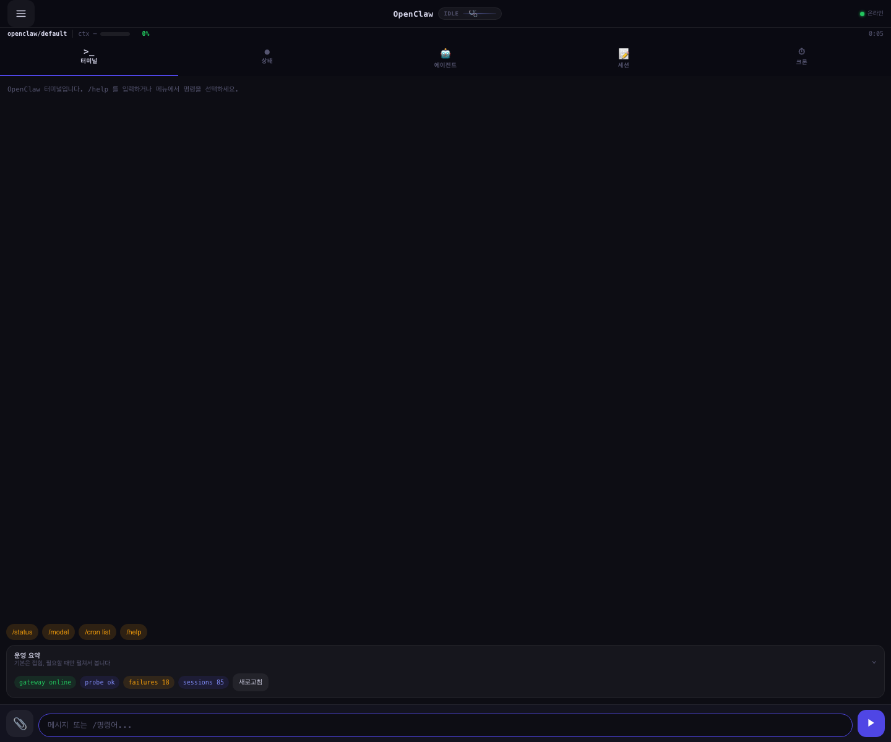
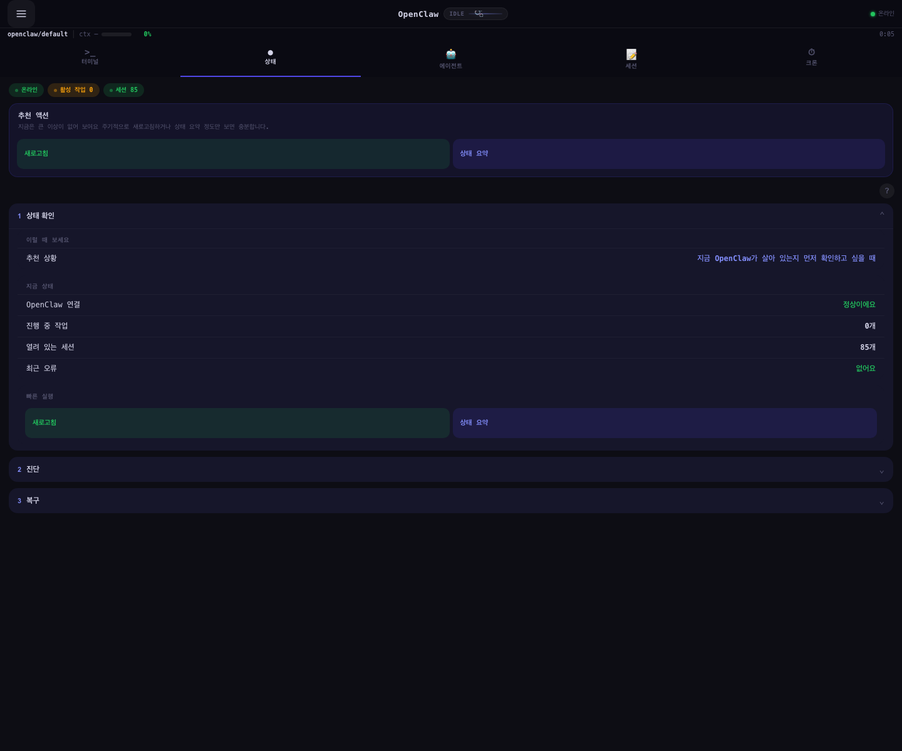
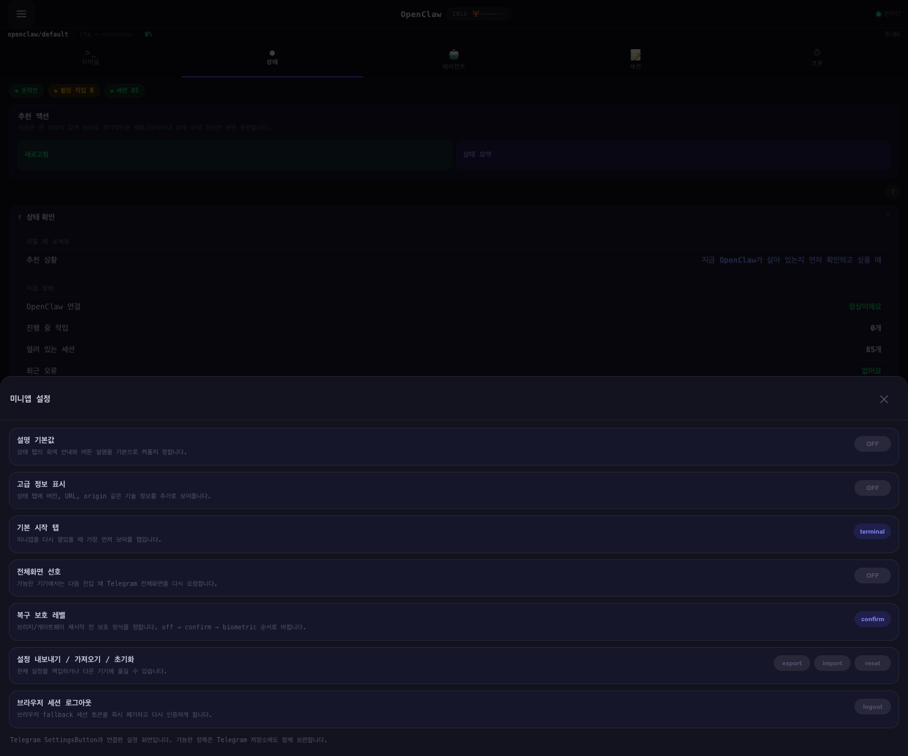
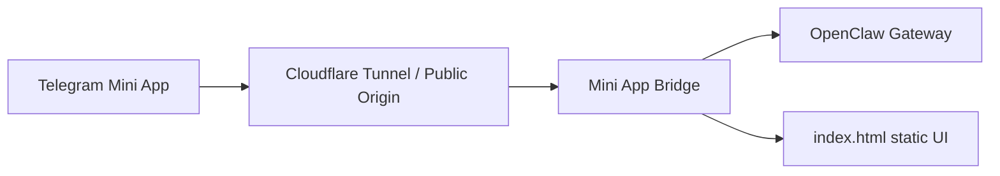

# OpenClaw Telegram Mini App

<div align="center">


**🚀 Telegram에서 바로 사용하는 OpenClaw 제어 센터**

간편한 채팅, 크론 작업 관리, 시스템 모니터링까지 - 모든 것을 Telegram 안에서

</div>

---

Telegram 안에서 OpenClaw를 더 빠르고 가볍게 다루기 위한 **한국어 Telegram Mini App 포크**입니다.
원본 프로젝트인 [clawvader-tech/hermes-telegram-miniapp](https://github.com/clawvader-tech/hermes-telegram-miniapp)을 바탕으로 OpenClaw 환경에 맞게 포팅했고, 원본의 MIT 라이선스를 그대로 유지합니다.

먼저, 훌륭한 기반 프로젝트를 공개해 준 원작자에게 감사드립니다.
이 포크는 원작의 방향성과 장점을 존중하면서, OpenClaw에서 바로 쓸 수 있는 실용적인 형태로 다듬는 것을 목표로 합니다.

## ✨ 한 줄 소개

**OpenClaw용 Telegram Mini App companion**입니다.
채팅만 붙인 데모가 아니라, 모바일에서 OpenClaw의 **chat, status, sessions, agents, cron**을 바로 확인하고 다룰 수 있게 만드는 쪽에 초점을 두고 있습니다.

## 미리 보기

| Terminal | Status | Settings |
|---|---|---|
|  |  |  |

## 왜 이 리포를 봐야 하나요?

이 포크는 아래 같은 OpenClaw 사용자에게 특히 잘 맞습니다.

- Telegram 안에서 바로 OpenClaw를 열고 싶은 사람
- 모바일에서 상태 확인과 간단한 운영 작업까지 하고 싶은 사람
- 한국어 UI가 필요한 사람
- Cloudflare Tunnel 기반으로 self-hosted Mini App을 붙이고 싶은 사람
- Hermes용 Mini App 아이디어를 OpenClaw에 맞게 재구성한 사례가 필요한 사람

즉, "Hermes용 Mini App을 억지로 흉내 내는 포크"가 아니라,
**OpenClaw에 맞게 다시 연결한 Telegram Mini App 포크**에 가깝습니다.

## 🚀 현재 상태

이 포크는 이미 **기본 동작 가능한 수준**을 넘어서,
OpenClaw 운영 companion으로 실제 써볼 수 있는 단계까지 올라와 있습니다.

<div align="center">

| 상태 | 설명 |
|------|------|
| ✅ **Core 기능** | 채팅, 상태 확인, 크론 관리 등 핵심 기능 동작 |
| ✅ **한국어 UI** | 모바일에 최적화된 한국어 인터페이스 |
| ✅ **인증 보안** | Ed25519 서명 검증으로 안전한 인증 |
| ✅ **운영 준비** | Cloudflare Tunnel 기반 실서비스 배포 가능 |

</div>

### 최근 업데이트

- OpenClaw 브랜딩 반영
- 한국어 UI 1차 적용
- OpenClaw chat 연결
- OpenClaw 세션 헤더 연결
- Mini App bridge 추가
- 크론 목록 조회 및 기본 액션 연결
- macOS용 bridge launchd 실행 구성 추가
- 런타임 상태, 에이전트, 세션 패널 추가
- 외부 health / cloudflared 상태 / diagnostics 표시 강화
- owner 제한 및 인증 하드닝 반영
- browser fallback용 short-lived session token, refresh / revoke, rate limit 추가

## 🎮 지금 동작하는 것

현재 이 포크에서 동작하는 핵심 기능은 아래와 같습니다.

### 📱 Mobile Companion UI
- Telegram Mini App 기반 반응형 디자인
- 실시간 스트리밍 채팅 (타이핑 인디케이터 포함)
- 진행률 표시 막대 (컨텍스트 사용량 표시)
- 상태 패널 (시스템 리소스 모니터링)
- 세션 목록 / 세션 상태 확인 및 관리
- 에이전트 / subagent 상태 확인 및 조작
- 크론 작업 생성, 수정, 실행 및 모니터링

### 🔌 Bridge / API
- `/v1/chat/completions` 프록시 연결 (스트리밍 SSE)
- `/api/model-info` (모델 정보 조회)
- `/api/session-usage` (세션 사용량 통계)
- `/api/jobs` (크론 작업 CRUD)
- `/api/command` (간단한 명령 실행)
- `/api/runtime-status` (런타임 상태)
- `/api/subagents` (서브에이전트 관리)
- `/api/diagnostics` (진단 정보)

### ⚙️ 운영 기능
- 브라우저 fallback용 short-lived session token 인증
- Telegram Mini App Ed25519 인증 (안전한 서명 검증)
- owner 제한, rate limit, browser session refresh / revoke
- Cloudflare / public origin 이상 탐지용 diagnostics
- bridge launchd 실행 구성 (macOS)
- systemd 서비스 설정 (Linux)
- Cloudflare Tunnel 운영 체크리스트 포함

## 포함된 브리지

이 저장소에는 작은 OpenClaw 브리지 서버가 포함되어 있습니다.

- `bridge/openclaw_miniapp_bridge.py`
- `bridge/run_bridge.sh`
- `systemd/openclaw-miniapp-bridge.service`
- `launchd/ai.openclaw.miniapp-bridge.plist`

이 브리지는 Mini App 프런트와 OpenClaw 사이에서 다음 역할을 맡습니다.

- 정적 Mini App 파일 서빙
- OpenClaw chat endpoint 프록시
- 모델/세션 정보 조회
- `openclaw cron` 기반 작업 조회 및 액션 연결
- 간단한 명령 호환 레이어 제공
- subagents / diagnostics 같은 운영용 데이터 노출

---

## ⚡ 빠른 시작

<div align="center">

**10분 만에 OpenClaw Telegram Mini App 설치하기**

</div>

### 사전 준비물
- ✅ OpenClaw가 설치되고 실행 중인 서버
- ✅ Telegram 봇 토큰 (@BotFather에서 생성)
- ✅ Telegram 사용자 ID (@userinfobot에서 확인)
- ✅ 도메인 (Cloudflare Tunnel용)

## 빠른 문서 진입점

- 시작점: [`docs/START_HERE.md`](docs/START_HERE.md)
- 아키텍처: [`docs/ARCHITECTURE.md`](docs/ARCHITECTURE.md)
- E2E 예시: [`docs/E2E_EXAMPLE.md`](docs/E2E_EXAMPLE.md)

## 에이전트 설치 경로

이 저장소는 이제 **GitHub를 source of truth로 두고, OpenClaw 에이전트가 직접 clone / update / install** 할 수 있는 형태를 목표로 정리하고 있습니다.

에이전트나 자동화 설치 경로에서 먼저 읽을 문서:

1. [`docs/AGENT_INSTALL.md`](docs/AGENT_INSTALL.md)
2. [`docs/GITHUB_DEPLOYMENT.md`](docs/GITHUB_DEPLOYMENT.md)
3. [`scripts/install.sh`](scripts/install.sh)
4. [`scripts/verify_deployment.py`](scripts/verify_deployment.py)
5. [`scripts/check_repo.sh`](scripts/check_repo.sh)
6. [`scripts/smoke_install.sh`](scripts/smoke_install.sh)
7. [`scripts/runtime_smoke.sh`](scripts/runtime_smoke.sh)
8. [`docs/START_HERE.md`](docs/START_HERE.md)
9. [`.env.example`](.env.example)
10. [`requirements.txt`](requirements.txt)
11. [`OPERATIONS_CHECKLIST.md`](OPERATIONS_CHECKLIST.md)
12. [`Dockerfile`](Dockerfile)
13. [`docker-compose.yml`](docker-compose.yml)

핵심 원칙:
- repo에는 **문서, 템플릿, 설치 스크립트, 예시 설정**만 둡니다
- 실제 token, password, secrets store는 **로컬 머신에만 둡니다**
- 에이전트는 GitHub에서 repo를 가져오되, 머신 고유값은 로컬 service 설정에만 주입해야 합니다
- 설치 완료 선언 전에는 반드시 `scripts/verify_deployment.py` 로 health 검증을 통과해야 합니다
- PR이나 push 전에는 `scripts/check_repo.sh` 와 GitHub Actions CI가 같은 기본 검증을 수행합니다
- CI는 unattended install smoke test, bridge runtime smoke test, Docker image build까지 검증합니다

### 설치 단계

1. **리포지토리 클론**
   ```bash
   git clone https://github.com/techkwon/openclaw-telegram-miniapp.git
   cd openclaw-telegram-miniapp
   ```

2. **환경 변수 설정**
   ```bash
   cp .env.example .env
   # .env 파일에 필요한 설정들 입력
   ```

3. **OpenClaw Gateway 설정**
   ```json5
   {
     gateway: {
       http: {
         endpoints: {
           chatCompletions: { enabled: true }
         }
       }
     }
   }
   ```

4. **Cloudflare Tunnel 설정**
   ```bash
   cloudflared tunnel login
   cloudflared tunnel create openclaw-miniapp
   cloudflared tunnel route dns openclaw-miniapp yourdomain.com
   ```

5. **서비스 시작**
   ```bash
   # macOS
   cp launchd/ai.openclaw.miniapp-bridge.plist ~/Library/LaunchAgents/
   launchctl load ~/Library/LaunchAgents/ai.openclaw.miniapp-bridge.plist
   
   # Linux
   cp systemd/openclaw-miniapp-bridge.service /etc/systemd/system/
   systemctl enable openclaw-miniapp-bridge
   systemctl start openclaw-miniapp-bridge
   ```

6. **Telegram 봇 설정**
   - @BotFather에서 `/setmenubutton` 실행
   - Mini App URL 설정: `https://yourdomain.com`

🎉 **설치 완료!** 이제 Telegram에서 봇의 메뉴 버튼을 눌러 Mini App을 실행하세요.

---

## OpenClaw 설정에서 필요한 것

채팅 프록시를 사용하려면 OpenClaw Gateway에서 HTTP chat completions endpoint를 켜야 합니다.

```json5
{
  gateway: {
    http: {
      endpoints: {
        chatCompletions: { enabled: true }
      }
    }
  }
}
```

설정 후에는 gateway 재시작이 필요합니다.

## 보안 메모

브라우저에서 직접 여는 fallback 모드는 장기 shared token을 계속 저장하지 않고, bridge가 발급하는 짧은 세션 토큰을 사용합니다.

- 기본 browser session TTL: `MINIAPP_BROWSER_SESSION_TTL_SECONDS` (기본 1800초)
- 기본 rate limit window: `MINIAPP_RATE_LIMIT_WINDOW_SECONDS` (기본 60초)
- 일반 요청 limit: `MINIAPP_RATE_LIMIT_MAX_REQUESTS`
- 민감 액션 limit: `MINIAPP_RATE_LIMIT_ACTION_MAX_REQUESTS`
- 인증 디버그 로그: `MINIAPP_AUTH_DEBUG=false` 권장
- bridge는 시작 시 주요 설정값을 검증하고, 잘못된 배포 설정이면 즉시 종료합니다.
- 요청 로그는 JSON 한 줄 형식으로 남기며, bearer token 원문은 기록하지 않습니다.

개인 사용자 배포에서는 기본값으로도 충분하지만, public 노출이 크면 TTL을 더 짧게 조정하는 쪽이 안전합니다.

## CI / 컨테이너 경로

이제 저장소에는 아래 약점 보강 경로가 추가되어 있습니다.

- GitHub Actions CI: `.github/workflows/ci.yml`
- 공통 체크 스크립트: `scripts/check_repo.sh`
- unattended install smoke test: `scripts/smoke_install.sh`
- 컨테이너 이미지 빌드 경로: `Dockerfile`
- 컨테이너 실행 예시: `docker-compose.yml`

빠른 로컬 체크:

```bash
./scripts/check_repo.sh
```

빠른 Docker 빌드 예시:

```bash
docker build -t openclaw-telegram-miniapp .
```

빠른 compose 실행 예시:

```bash
docker compose up -d --build
```

## 구조 한눈에 보기



## Production 체크리스트

배포 전에 아래 항목을 확인하세요.

- `MINIAPP_PUBLIC_ORIGIN` 이 실제 공개 HTTPS URL과 일치하는지
- `TELEGRAM_BOT_TOKEN`, `TELEGRAM_OWNER_ID` 또는 `TELEGRAM_OWNER_IDS` 가 정확한지
- `OPENCLAW_BASE_URL` 이 실제 gateway 주소인지
- gateway 쪽 `chatCompletions` endpoint가 활성화되어 있는지
- `OPENCLAW_GATEWAY_TOKEN` 또는 `OPENCLAW_GATEWAY_PASSWORD` 가 현재 gateway 설정과 맞는지
- `MINIAPP_AUTH_DEBUG=false` 로 꺼져 있는지
- 브리지와 cloudflared 로그 경로가 실제 서비스 계정에서 쓰기 가능한지
- Cloudflare Tunnel이 named tunnel + 고정 도메인으로 올라오는지
- Telegram Menu Button URL이 최종 공개 origin으로 설정되었는지

권장 추가 점검:

- browser fallback 세션 TTL을 공개 노출 정도에 맞게 10~30분 범위에서 조정
- bridge 재시작 후 `/health`, `/api/diagnostics`, 실제 Mini App 진입까지 한 번씩 확인
- 운영 중에는 구조화 로그의 `status`, `duration_ms`, `auth_kind` 필드를 기준으로 이상 징후를 확인

## 빠른 배포 개요

현재 로컬 브리지는 `127.0.0.1:8765` 에서 동작하도록 맞춰져 있고,
실배포 기본 도메인은 아래 기준으로 정리했습니다.

- 권장 Mini App origin: `https://miniapp.techkwon.kr`
- launchd 기본값: `MINIAPP_PUBLIC_ORIGIN=https://miniapp.techkwon.kr`
- Cloudflare Tunnel 예시 파일: `tunnel/cloudflared-config.yml`

권장 배포 순서:

1. `cloudflared tunnel login`
2. `cloudflared tunnel create openclaw-miniapp`
3. `cloudflared tunnel route dns openclaw-miniapp miniapp.techkwon.kr`
4. `~/.cloudflared/config.yml` 에 `tunnel/cloudflared-config.yml` 내용을 실제 tunnel UUID로 반영
5. `cloudflared tunnel --config ~/.cloudflared/config.yml tunnel run openclaw-miniapp`
6. Telegram Bot 설정에서 Mini App URL 또는 Menu Button URL을 `https://miniapp.techkwon.kr` 로 교체

주의:

- Telegram Mini App 엔트리포인트는 `trycloudflare.com` 같은 임시 URL보다 고정 hostname이 훨씬 안전합니다.
- 실제 Telegram 쪽 URL 교체는 Cloudflare named tunnel이 정상 응답하는 것을 먼저 확인한 뒤 진행하는 것이 좋습니다.
- launchd plist를 수정한 뒤 환경 변수를 확실히 반영하려면 단순 kickstart보다 `bootout -> bootstrap` 재적용이 더 안전할 수 있습니다.
- 운영 중 장애 분리 순서는 [`OPERATIONS_CHECKLIST.md`](OPERATIONS_CHECKLIST.md)를 바로 참고하면 됩니다.

## 이 포크가 원본과 다른 점

원본 프로젝트는 이미 훌륭한 사용자 경험과 UI 감각을 갖고 있었습니다.
다만 OpenClaw는 Hermes와 백엔드 구조가 완전히 같지 않기 때문에, 그대로 가져오면 동작하지 않는 지점들이 있었습니다.

그래서 이 포크에서는 아래 원칙을 지키고 있습니다.

- 안 되는 기능을 되는 척하지 않기
- OpenClaw에 맞는 연결 방식을 명확히 만들기
- 원본 크레딧과 라이선스 의무를 유지하기
- 사용자 입장에서는 더 단순하고 실용적으로 보이게 만들기
- 관리자용 대시보드를 그대로 노출하기보다 모바일 companion 경험에 집중하기

## 저장소에서 바로 볼 만한 파일

- `bridge/openclaw_miniapp_bridge.py` - OpenClaw 연결 핵심 bridge
- `index.html` - Mini App 프런트엔드
- `docs/AGENT_INSTALL.md` - OpenClaw 에이전트용 설치 가이드
- `docs/GITHUB_DEPLOYMENT.md` - GitHub-only 배포 가이드
- `OPERATIONS_CHECKLIST.md` - 장애 대응 체크리스트
- `tunnel/cloudflared-config.yml` - Cloudflare Tunnel 예시 설정
- `launchd/ai.openclaw.miniapp-bridge.plist` - macOS launchd 예시

## 앞으로 더 다듬을 부분

아직 더 좋아질 수 있는 부분도 분명히 있습니다.

- README에 실제 스크린샷 / GIF 추가
- 상태/크론 패널의 OpenClaw 네이티브 데이터 확장
- Telegram Mini App 인증 검증 고도화
- 설치/배포 문서 세분화
- 세션/에이전트 조작 UX 개선

## 개발 방향

이 포크는 다음 원칙으로 유지합니다.

- 원본 MIT 라이선스 유지
- 원작자 명시적 크레딧 유지
- 포크 상태를 README에서 정직하게 설명
- OpenClaw에 없는 Hermes 전용 기능을 과장하지 않음
- OpenClaw 사용자 경험은 한국어 중심으로 정리
- 모바일 운영 companion으로서 실제 유용성을 우선함

## 저장소 링크

- 원본 프로젝트: <https://github.com/clawvader-tech/hermes-telegram-miniapp>
- 이 포크: <https://github.com/techkwon/openclaw-telegram-miniapp>

## 라이선스

원본 프로젝트와 이 포크는 모두 MIT License를 따릅니다.
자세한 내용은 [LICENSE](LICENSE)를 참고해 주세요.
