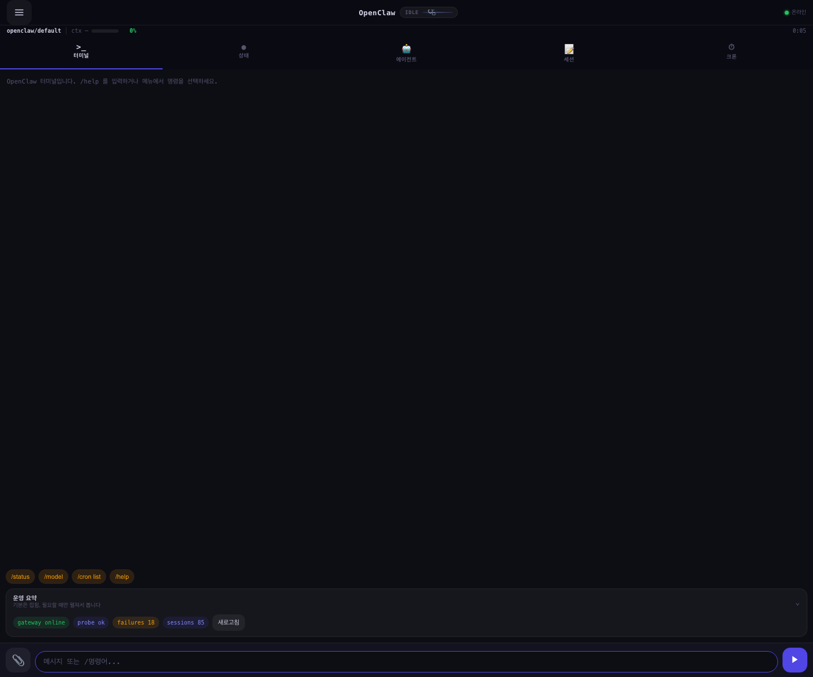
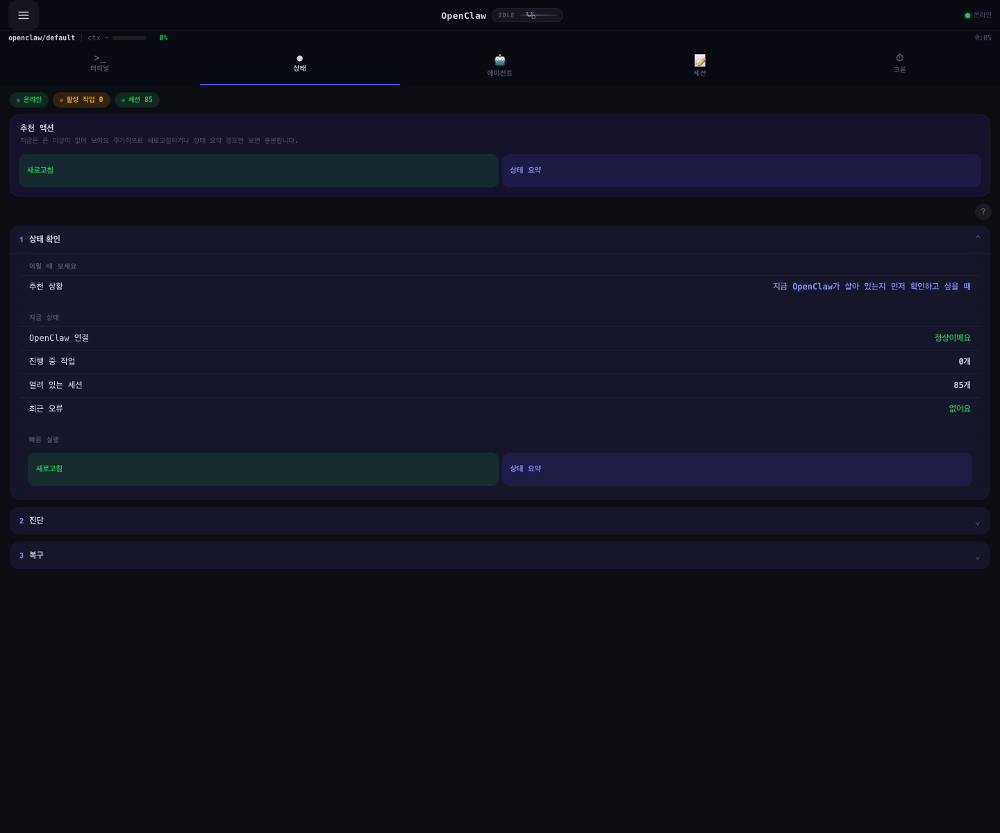
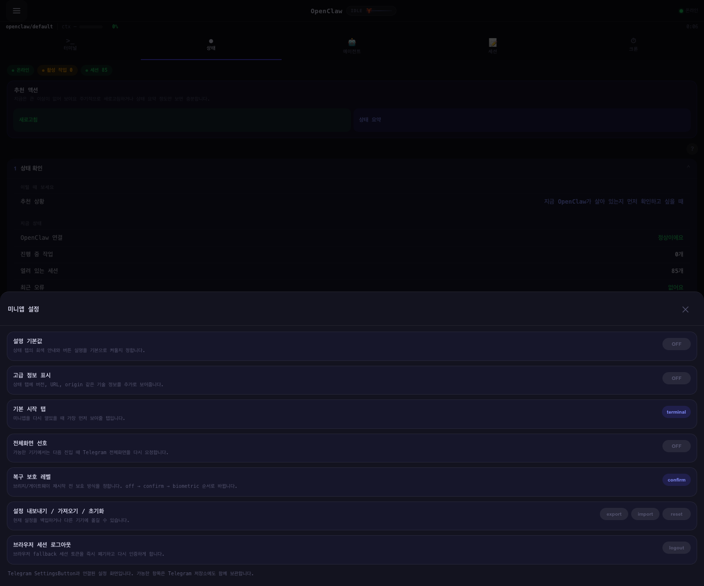
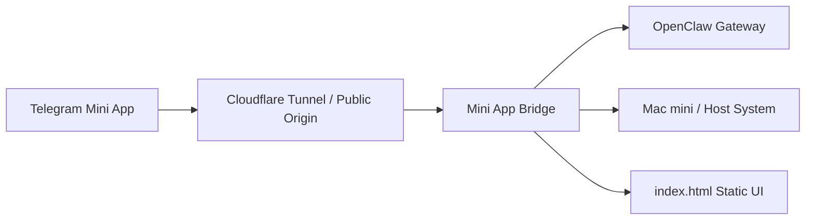

# OpenClaw Telegram Mini App

<div align="center">


**Telegram 안에서 쓰는 OpenClaw 모바일 운영 패널**

채팅, 상태 확인, 세션, 에이전트, 크론, 맥미니 시스템 모니터링까지 — OpenClaw를 손 안에서 가볍게 다룹니다.

</div>

---

## 소개

**OpenClaw Telegram Mini App**은 Telegram Mini App 안에서 OpenClaw를 제어하고 모니터링하기 위한 한국어 중심 companion UI입니다.

이 저장소는 [clawvader-tech/hermes-telegram-miniapp](https://github.com/clawvader-tech/hermes-telegram-miniapp)을 기반으로 만든 OpenClaw 포크입니다. 원본 프로젝트의 좋은 UX와 MIT 라이선스를 존중하며, OpenClaw Gateway와 운영 흐름에 맞도록 bridge, 인증, 세션, 크론, 시스템 상태 기능을 다시 연결했습니다.

원작자에게 감사드립니다. 이 포크는 원본을 대체하려는 프로젝트가 아니라, **OpenClaw 환경에서 바로 실사용 가능한 Telegram Mini App companion**으로 발전시키는 것을 목표로 합니다.

## 핵심 기능

### 1. Terminal

- Telegram 안에서 OpenClaw와 바로 대화
- `/command` 기반 빠른 운영 명령
- 모델 / 컨텍스트 / 토큰 사용량 표시
- 파일 첨부 UI와 빠른 프롬프트 버튼

### 2. Status

- OpenClaw Gateway 연결 상태
- 활성 작업 / 세션 수 / 최근 오류 표시
- Cloudflare Tunnel, public origin, bridge diagnostics
- 브리지 / 게이트웨이 복구 액션

### 3. System

맥미니나 self-hosted 머신 상태를 Mini App에서 바로 확인합니다.

- CPU / 메모리 / 디스크 사용률 카드
- macOS / Apple Silicon / uptime 표시
- OpenClaw 운영 상태 카드
  - Gateway
  - Bridge
  - Tunnel
  - Public origin
- 실행 중인 앱 목록
- CPU 사용량 상위 프로세스 목록
- 보호 로직이 있는 프로세스 종료 버튼
- bridge / cloudflared 최근 오류 요약

> Kill 기능은 편의를 위한 운영 보조 기능입니다. `openclaw-gateway`, bridge, launchd, system daemon, 다른 사용자 프로세스는 보호 처리합니다.

### 4. Agents

- OpenClaw agent / heartbeat 상태 확인
- subagent 목록 확인
- subagent steer / kill 액션 연결

### 5. Sessions

- 최근 세션 목록 보기
- 세션 상태 / 요약 / 기록 확인
- 특정 세션에 메시지 보내기
- 새 explicit session 생성

### 6. Cron

- OpenClaw cron 작업 목록
- 작업 생성 / 수정 / 실행 / 일시중지 / 재개 / 삭제
- Telegram 안에서 반복 작업을 빠르게 관리

## 미리 보기

| Terminal | Status | Settings |
|---|---|---|
|  |  |  |

> System 탭 스크린샷은 추후 추가 예정입니다.

## 아키텍처


```mermaid
flowchart LR
  TG[Telegram Mini App] --> CF[Cloudflare Tunnel / Public Origin]
  CF --> BR[Mini App Bridge]
  BR --> GW[OpenClaw Gateway]
  BR --> HOST[Mac mini / Host System]
  BR --> UI[index.html Static UI]
```

브리지는 `index.html`을 서빙하고, Telegram Mini App 프런트엔드와 OpenClaw Gateway 사이에서 안전한 API 레이어 역할을 합니다.

## 포함된 구성요소

| 경로 | 설명 |
|---|---|
| `index.html` | Telegram Mini App 프런트엔드 |
| `bridge/openclaw_miniapp_bridge.py` | OpenClaw bridge 서버 |
| `bridge/run_bridge.sh` | bridge 실행 스크립트 |
| `launchd/ai.openclaw.miniapp-bridge.plist` | macOS launchd 예시 |
| `systemd/openclaw-miniapp-bridge.service` | Linux systemd 예시 |
| `tunnel/cloudflared-config.yml` | Cloudflare Tunnel 예시 |
| `OPERATIONS_CHECKLIST.md` | 운영 / 장애 대응 체크리스트 |
| `scripts/check_repo.sh` | repo 검증 스크립트 |
| `scripts/verify_deployment.py` | 배포 검증 스크립트 |

## Bridge API 요약

### Runtime / OpenClaw

- `GET /health`
- `GET /api/model-info`
- `GET /api/session-usage`
- `GET /api/runtime-status`
- `GET /api/diagnostics`
- `GET /api/subagents`
- `POST /v1/chat/completions`
- `POST /api/command`

### Cron

- `GET /api/jobs`
- `GET /api/jobs/<id>`
- `POST /api/jobs`
- `PATCH /api/jobs/<id>`
- `DELETE /api/jobs/<id>`
- `POST /api/jobs/<id>/run`
- `POST /api/jobs/<id>/pause`
- `POST /api/jobs/<id>/resume`

### System Dashboard

- `GET /api/system-info`
- `GET /api/system-apps`
- `GET /api/system-processes`
- `GET /api/system-errors`
- `POST /api/system-processes/kill`

## 빠른 시작

### 사전 준비

- OpenClaw Gateway가 실행 중인 머신
- Telegram Bot Token
- Telegram owner user id
- HTTPS public origin
- 권장: Cloudflare named tunnel + 고정 hostname

### 1. Clone

```bash
git clone https://github.com/techkwon/openclaw-telegram-miniapp.git
cd openclaw-telegram-miniapp
```

### 2. 환경 변수 준비

```bash
cp .env.example .env
# .env 파일에 실제 값을 입력하세요.
```

주요 환경 변수:

```bash
MINIAPP_HOST=127.0.0.1
MINIAPP_PORT=8765
MINIAPP_PUBLIC_ORIGIN=https://miniapp.example.com
OPENCLAW_BASE_URL=http://127.0.0.1:18789
OPENCLAW_GATEWAY_TOKEN=...
TELEGRAM_BOT_TOKEN=...
TELEGRAM_OWNER_ID=...
```

### 3. OpenClaw Gateway 설정

채팅 프록시를 사용하려면 OpenClaw Gateway에서 HTTP chat completions endpoint가 켜져 있어야 합니다.

```json5
{
  gateway: {
    http: {
      endpoints: {
        chatCompletions: { enabled: true }
      }
    }
  }
}
```

설정 변경 후에는 gateway 재시작이 필요할 수 있습니다.

### 4. Bridge 실행

```bash
python3 bridge/openclaw_miniapp_bridge.py
```

health 확인:

```bash
curl http://127.0.0.1:8765/health
```

예상 응답:

```json
{"ok": true, "status": "live"}
```

## macOS launchd 배포

```bash
cp launchd/ai.openclaw.miniapp-bridge.plist ~/Library/LaunchAgents/
launchctl bootstrap gui/$(id -u) ~/Library/LaunchAgents/ai.openclaw.miniapp-bridge.plist
launchctl kickstart -k gui/$(id -u)/ai.openclaw.miniapp-bridge
```

상태 확인:

```bash
launchctl print gui/$(id -u)/ai.openclaw.miniapp-bridge
curl http://127.0.0.1:8765/health
```

> launchd plist의 환경 변수를 수정한 경우 단순 `kickstart`만으로는 반영되지 않을 수 있습니다. 이때는 `bootout -> bootstrap` 순서로 다시 올리는 편이 안전합니다.

## Linux systemd 배포

```bash
sudo cp systemd/openclaw-miniapp-bridge.service /etc/systemd/system/
sudo systemctl daemon-reload
sudo systemctl enable --now openclaw-miniapp-bridge
sudo systemctl status openclaw-miniapp-bridge
```

## Cloudflare Tunnel 권장 구성

Telegram Mini App은 임시 tunnel URL보다 고정 hostname이 훨씬 안정적입니다.

권장 흐름:

```bash
cloudflared tunnel login
cloudflared tunnel create openclaw-miniapp
cloudflared tunnel route dns openclaw-miniapp miniapp.example.com
cloudflared tunnel --config ~/.cloudflared/config.yml run openclaw-miniapp
```

예시 설정은 [`tunnel/cloudflared-config.yml`](tunnel/cloudflared-config.yml)을 참고하세요.

## Telegram Bot 연결

BotFather에서 Menu Button 또는 Mini App URL을 public origin으로 설정합니다.

```text
https://miniapp.example.com
```

설정 후 Telegram에서 봇 메뉴 버튼을 열면 Mini App이 실행됩니다.

## 보안 원칙

이 Mini App은 운영 패널 성격을 갖기 때문에 아래 원칙을 지킵니다.

- Telegram Mini App `initData` 검증
- Ed25519 기반 서명 검증 지원
- owner id 제한
- browser fallback용 short-lived session token
- refresh / revoke 지원
- 요청 rate limit
- bearer token 원문 로그 금지
- 인증 없는 API 접근 차단
- 위험한 프로세스 종료 보호 로직

운영 환경에서는 특히 아래를 확인하세요.

- `MINIAPP_AUTH_DEBUG=false`
- `MINIAPP_PUBLIC_ORIGIN`이 실제 public origin과 일치
- `TELEGRAM_OWNER_ID` 또는 `TELEGRAM_OWNER_IDS` 설정
- `OPENCLAW_GATEWAY_TOKEN` 또는 `OPENCLAW_GATEWAY_PASSWORD` 설정
- Cloudflare Tunnel이 named tunnel로 실행 중인지 확인

## 개발 / 검증

빠른 repo 체크:

```bash
./scripts/check_repo.sh
```

Python syntax check:

```bash
python3 -m py_compile bridge/openclaw_miniapp_bridge.py
```

배포 검증:

```bash
python3 scripts/verify_deployment.py
```

Docker build:

```bash
docker build -t openclaw-telegram-miniapp .
```

Docker Compose:

```bash
docker compose up -d --build
```

## 문서

- 시작점: [`docs/START_HERE.md`](docs/START_HERE.md)
- 아키텍처: [`docs/ARCHITECTURE.md`](docs/ARCHITECTURE.md)
- 에이전트 설치: [`docs/AGENT_INSTALL.md`](docs/AGENT_INSTALL.md)
- GitHub 배포: [`docs/GITHUB_DEPLOYMENT.md`](docs/GITHUB_DEPLOYMENT.md)
- E2E 예시: [`docs/E2E_EXAMPLE.md`](docs/E2E_EXAMPLE.md)
- 운영 체크리스트: [`OPERATIONS_CHECKLIST.md`](OPERATIONS_CHECKLIST.md)

## 이 포크가 원본과 다른 점

원본은 Hermes 환경을 위한 Mini App입니다. 이 포크는 OpenClaw 환경에 맞춰 다음을 추가/변경했습니다.

- OpenClaw Gateway chat completions proxy
- OpenClaw runtime / session / agent / cron 연동
- 한국어 중심 모바일 UI
- Telegram Mini App 인증 하드닝
- Cloudflare Tunnel / public origin diagnostics
- macOS launchd 운영 경로
- Mac mini system dashboard
- 실행 중 앱 / 프로세스 모니터링
- 운영 로그와 최근 오류 요약

## 개발 방향

이 프로젝트는 OpenClaw의 전체 관리자 콘솔을 그대로 노출하기보다, Telegram 안에서 자주 필요한 운영 기능을 안전하고 가볍게 제공하는 companion을 지향합니다.

앞으로의 개선 후보:

- System 탭 스크린샷 추가
- 앱/프로세스 필터와 검색
- 안전한 임시 파일 / 브라우저 캡처 프로필 정리 버튼
- OpenClaw service별 세부 health card
- 모바일 UX polish와 접근성 개선
- GitHub Releases / 배포 자동화

## 저장소 링크

- 원본 프로젝트: <https://github.com/clawvader-tech/hermes-telegram-miniapp>
- 이 포크: <https://github.com/techkwon/openclaw-telegram-miniapp>

## License

이 프로젝트는 원본과 동일하게 MIT License를 따릅니다. 자세한 내용은 [LICENSE](LICENSE)를 참고하세요.
