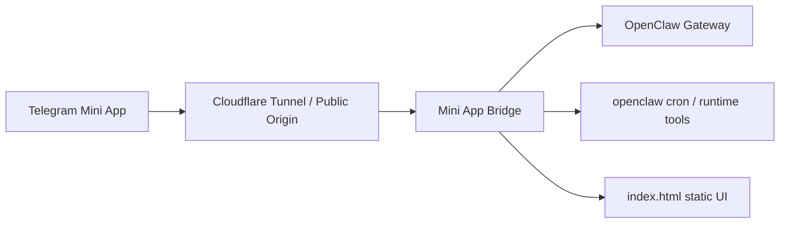

# Architecture

## Notes
- Telegram is the primary auth path via initData validation.
- Browser fallback exists, but short-lived bridge-issued session tokens are preferred over storing a long-lived shared token.
- The bridge is intentionally small and acts as a compatibility/control layer between the static Mini App UI and OpenClaw.
